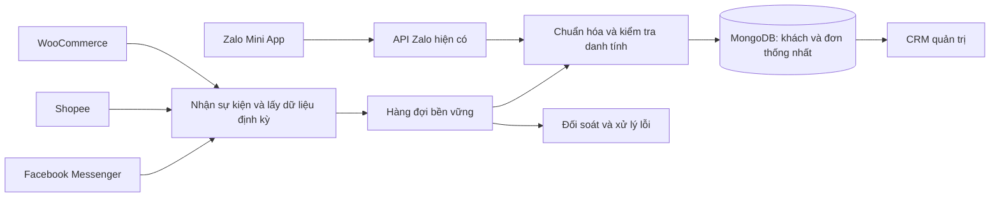

# Đánh giá backend và kế hoạch đồng bộ khách hàng, đơn hàng đa kênh

Ngày đánh giá: 08/10/2026. Phạm vi đã xác nhận: website WordPress/WooCommerce; Facebook Messenger và đơn chốt qua chat; Shopee; giữ luồng Zalo Mini App. Giai đoạn đầu nhận dữ liệu một chiều về backend.

## 1. Kết luận và giới hạn đánh giá

Backend có thể phát triển thành trung tâm quản lý khách hàng và đơn hàng đa kênh. Có thể tái sử dụng Express, TypeScript, MongoDB/Mongoose và giao diện React hiện tại. Chưa đủ điều kiện vận hành đồng bộ đa kênh tin cậy: thiếu bảo vệ API quản trị, định danh khách theo từng kênh, khóa chống trùng đơn, bộ xử lý đồng bộ và đối soát.

Đây là đánh giá mã nguồn, cấu hình và kiểm thử cục bộ; chưa kiểm tra dữ liệu MongoDB thật, quyền tài khoản nền tảng, bản triển khai đang phục vụ hay tải thực tế. Không khởi động server chính trong đánh giá vì quá trình khởi động có seed dữ liệu, thay đổi index và migration tài khoản. Không sửa mã nghiệp vụ hoặc kết nối tài khoản thật trong bước lập kế hoạch.

Kiểm tra TypeScript đạt. 28 ca kiểm thử hiện có đạt khi tổng hợp lần chạy đầu và lần chạy lại nhóm phiếu xuất: lần đầu 27/28, một ca HTTP bị sandbox chặn localhost bằng EACCES; chạy lại nhóm 7 ca phiếu xuất ngoài sandbox đạt 7/7. Các test dùng dữ liệu giả, bao phủ nhập khách, cầu nối Google Sheets, phiếu xuất, giá/VAT, giao diện in và bản nháp. Kết quả này không chứng minh luồng Zalo, thanh toán, đồng bộ đa kênh hoặc chịu tải đã đạt.

## 2. Năng lực hiện có và khoảng trống

| Hạng mục | Bằng chứng trong mã | Đánh giá |
| --- | --- | --- |
| API và dữ liệu chính | `server.ts`, `src/models/Customer.ts` | Đường chạy chính là Express và MongoDB. NeDB/NestJS còn tồn tại trong mã khác nhưng không được bootstrap bởi `server.ts`; không mặc định coi các file `.db` là dữ liệu khách/đơn đang chạy. |
| Khách hàng | Customer có tên, SĐT, email, địa chỉ, nhóm, điểm, tổng đơn/chi tiêu | Dùng lại được. Chưa có danh tính kênh hoặc quan hệ khách–đơn bằng `customerId`. |
| Khách Zalo | `src/controllers/spinUserController.ts`, `src/models/SpinUser.ts` | Đã có nhận hồ sơ, giải mã SĐT khi đủ thông tin, liên hệ Customer qua SĐT. Zalo ID nằm ở SpinUser, chưa thành bản đồ danh tính chung. |
| Đơn hàng | `server.ts:74`, `server.ts:855` | Có tạo/xem/sửa/xóa và lọc platform. POST đơn gán cứng `Zalo Mini App`; orderCode chỉ có index thường. Thiếu khóa duy nhất theo nguồn/shop/mã đơn ngoài. |
| Tổng chi tiêu | `server.ts:955` | Cộng khi tạo đơn, cả đơn pending; chưa thấy tính lại khi hủy/hoàn tiền hoặc cập nhật tổng. Có thể sai khi retry hoặc hai đơn xử lý đồng thời. |
| Kho | `server.ts:130` | Có trừ/hoàn theo trạng thái, nhưng đọc–sửa–ghi nhiều bản ghi không có transaction. Thiếu sổ biến động; có thể mất cập nhật hoặc trừ hai lần khi xử lý đồng thời. |
| Nhập Excel | `src/lib/customerImport.ts`, `server.ts:1690` | Khách có importKey chống nhập lặp cùng nội dung và giữ lịch sử. Nhập đơn tạo mới từng dòng, không chống nhập lặp; chưa liên kết hồ sơ hoặc đồng bộ chỉ số khách. |
| Hồ sơ 360 độ | `src/components/customers/CustomerDetail.tsx:213` | Khối đơn hàng đang hiển thị cố định “Đơn hàng (0)”/“Trống”, chưa truy vấn lịch sử thật. |
| AppSheet | `src/services/appSheetSync.ts`, `docs/KET_NOI_APPSHEET.md` | Có mã backend → Sheets → AppSheet, lưu vị trí, hash và lease trong MongoDB. Không phải lớp nhập dữ liệu đa kênh; `.env` local chưa có nhóm biến APPSHEET. Chưa xác minh cấu hình production. |
| WooCommerce | `package.json` | Đã cài thư viện API WooCommerce, chưa thấy connector thực thi trong luồng server. |
| Facebook/Shopee | Mã server, routes, services và cấu hình local | Chưa thấy connector, luồng cấp quyền, refresh token hoặc webhook dành cho hai kênh. |

Các vấn đề phải xử lý trước khi đưa thêm dữ liệu thật:

- **P0 – API quản trị chưa có xác thực/kiểm tra quyền phía server.** Login so sánh bcrypt nhưng chỉ trả hồ sơ; frontend tin `admin_user` trong localStorage. Chưa thấy middleware bảo vệ đọc/xuất/sửa/xóa khách, đơn, nhân viên. CORS không thay thế xác thực. Kết luận dựa trên mã; chưa kiểm tra lớp bảo vệ ngoài ứng dụng nếu có.
- **P0 – Bí mật xuất hiện trong file được Git theo dõi.** `app.yaml`, `.env.example` và giá trị dự phòng trong `server.ts` có thông tin truy cập trông như khóa/mật khẩu thật. Cần xác minh chủ sở hữu, đổi các thông tin còn hiệu lực, đưa vào nơi quản lý bí mật và bỏ giá trị thật khỏi mã. Không chép giá trị vào báo cáo. Frontend còn ghi đối tượng form đăng nhập ra console trong `src/App.tsx:162`.
- **P0 – Webhook Zalo có hành động xóa nhưng chưa thấy xác minh chữ ký.** `server.ts:1515` có xóa theo phone và TODO cho Zalo ID; cần xác minh nguồn gửi trước khi xử lý, bổ sung định danh, hàng đợi và quy trình xóa/ẩn thông tin liên quan.
- **P1 – SĐT không phải khóa khách duy nhất.** Customer cố ý cho phép dùng chung SĐT; các luồng đặt đơn/vòng quay lại dùng `findOne({phone})`, có thể chọn nhầm doanh nghiệp/điểm giao. Chuẩn hóa SĐT không thống nhất giữa nhập Excel, vòng quay và đặt đơn.
- **P1 – Trạng thái và thanh toán chưa đủ chuẩn.** Kho dùng danh sách chuỗi tiếng Anh/Việt và so khớp `includes`; POST đơn đang đánh dấu phương thức khác COD là “Đã thanh toán” mà chưa dựa trên xác nhận thanh toán. Không dùng trực tiếp cho đơn nền tảng ngoài.
- **P1 – Quy mô vận hành chưa kiểm chứng.** API khách/đơn lấy toàn bộ danh sách, chưa phân trang; khách chưa có updatedAt chung cho đồng bộ. `app.yaml` gợi ý App Engine F1, nhưng chưa biết hosting thực tế hay tiến trình nền có được duy trì.

## 3. Phạm vi bản đầu tiên

Đầu ra là một nơi tra cứu khách, đơn, nguồn bán, shop/Fanpage, trạng thái, lịch sử chăm sóc và tình trạng kết nối. Nhận dữ liệu mới và cập nhật từ các kênh; nhập dữ liệu cũ trong khoảng thời gian được nền tảng cho phép.

Đơn nguồn ngoài được lưu thành bản phản chiếu để theo dõi. Các trường trạng thái/tổng tiền của nguồn được cập nhật từ nguồn; ghi chú và người phụ trách tại CRM có trường riêng. Nhân viên không sửa bản phản chiếu rồi hiểu rằng thao tác đã thay đổi đơn trên Shopee/WooCommerce.

Chưa gửi ngược trạng thái, giá, tồn kho, sản phẩm, voucher hay tin nhắn marketing. Bổ sung quan hệ mã sản phẩm/biến thể để hiểu dòng hàng, nhưng không thay nền tảng quản lý tồn kho trong bản đầu. Không chạy `syncOrderInventory` hoặc tăng lượt voucher/điểm chỉ vì nhập một đơn lịch sử từ kênh ngoài. Đơn chat được xác nhận tại CRM cần được phân biệt với bản sao nhập vào và chốt chính sách kho riêng trước khi ảnh hưởng kho.

Phiếu xuất hiện tại là chứng từ độc lập; không tự động tính thêm doanh thu nếu cùng giao dịch đã có trong đơn hàng. Không coi khách truy cập ẩn danh hoặc mọi người theo dõi Fanpage là hồ sơ có thể lấy đầy đủ thông tin.

## 4. Kiến trúc đề xuất

Giữ kiến trúc ứng dụng hiện có, tách dần logic khỏi `server.ts` thành dịch vụ khách, đơn, danh tính và từng connector. Worker xử lý đồng bộ chạy riêng khỏi API nhận yêu cầu. Chưa cần Kafka, data warehouse hoặc viết lại toàn bộ sang framework khác khi chưa có số liệu tải.

Mặc định đề xuất hàng đợi `SyncJob` trong MongoDB với index, claim nguyên tử, thời hạn lease, retry và nơi giữ việc lỗi để chạy lại. Worker dùng lịch chạy bền vững phù hợp hosting. Chốt cách triển khai sau khi biết tải và hạ tầng; nếu phát sinh nhu cầu Redis/managed queue thì phải có lý do đo được. Dùng transaction cho các thay đổi cần đồng nhất nếu MongoDB thực tế hỗ trợ, kết hợp khả năng chạy lại an toàn; không dựa vào timer trong RAM để bảo đảm tiến độ.

Luồng sự kiện: xác minh chữ ký trên nguyên nội dung nhận → lưu sự kiện/việc xử lý bền vững → trả phản hồi thành công → worker đọc bản mới nhất từ nền tảng nếu cần → chuẩn hóa → cập nhật theo khóa nguồn → cập nhật dữ liệu tra cứu → ghi kết quả. Nếu chưa lưu được sự kiện thì không báo đã nhận thành công. Tiến độ chỉ được nâng sau khi xử lý hoàn tất.

Nhận webhook để giảm độ trễ, kết hợp lấy dữ liệu định kỳ để bù sự kiện mất. Phân trang, lưu checkpoint theo từng kết nối, truy vấn khoảng thời gian chồng lấn và chống trùng ở DB. Xử lý giới hạn gọi API, timeout, 429, 5xx, token hết hạn; không retry vô hạn lỗi quyền hoặc dữ liệu sai. Dùng mã tương quan và nhật ký đã che dữ liệu nhạy cảm.

## 5. Thiết kế dữ liệu và quy tắc gộp

| Thành phần | Trường/quy tắc chính |
| --- | --- |
| Customer | Giữ `_id` cũ để tương thích; thêm mã tra cứu, updatedAt, loại cá nhân/doanh nghiệp, danh sách liên hệ/địa chỉ. Hồ sơ chuẩn có nguồn gốc và mức xác minh của từng thông tin. |
| CustomerIdentity | `customerId`, `channel`, `connectionId`, `externalCustomerId`. Khóa duy nhất theo kênh + kết nối + ID ngoài. Facebook phải gắn ID với Fanpage; không coi ID của các Page là ID toàn cầu. |
| Order | `customerId` có thể tạm trống khi chưa xác định; `channel`, `connectionId`, `externalOrderId`, `sourceStatus`, `status`, trạng thái thanh toán, tiền tệ, thời điểm nguồn và thời điểm đồng bộ. Giữ tên/SĐT/địa chỉ lúc đặt đơn như bản chụp lịch sử. |
| Khóa đơn nguồn ngoài | Unique index có điều kiện theo `channel + connectionId + externalOrderId`; bản ghi Zalo cũ thiếu khóa ngoài không bị ép cùng một khóa null. Upsert thay vì tạo mới khi nhận lại. |
| Dòng hàng và ProductMapping | Giữ ID sản phẩm/biến thể nguồn, SKU nguồn, số lượng, giá/giảm giá/thuế gốc; liên kết sản phẩm backend nếu đã ánh xạ. Không dùng ID Woo/Shopee làm Mongo ObjectId; SKU không rõ vẫn lưu đơn và đưa vào danh sách cần ánh xạ. |
| IntegrationConnection | Một bản ghi mỗi website/shop/Page, quyền đã cấp, trạng thái cấp quyền, bí mật được quản lý an toàn, hạn token, tiến độ, thời điểm thành công cuối. |
| SyncEvent/SyncJob/SyncRun | ID sự kiện và hash, loại việc, checkpoint, số lần thử, lease, kết quả, lỗi đã che dữ liệu, số bản ghi đọc/ghi/bỏ qua. Dữ liệu gốc chỉ lưu phần cần thiết, với thời hạn giữ được chốt. |
| CustomerMerge/AuditLog | Ai liên kết/gộp/tách hồ sơ, lý do và dữ liệu trước/sau; hỗ trợ sửa quyết định gộp nhầm. |

Thứ tự xác định khách:

1. Có danh tính nguồn đã ánh xạ: dùng đúng khách đã liên kết.
2. Chưa có ánh xạ: chuẩn hóa SĐT/email và tìm hồ sơ ứng viên. Chỉ liên kết tự động khi có bằng chứng tin cậy, một ứng viên duy nhất và không có dấu hiệu dùng chung liên hệ/xung đột; tiêu chí cụ thể phải chốt bằng dữ liệu mẫu.
3. SĐT chung, số bị che, khách doanh nghiệp, nhiều ứng viên hoặc thông tin mâu thuẫn: lưu riêng hoặc để chưa liên kết, đưa vào màn hình nhân viên xác nhận. Không gộp theo tên, địa chỉ, tổng tiền hay số điện thoại bị che.
4. Khách chưa có SĐT vẫn được ghi nhận theo danh tính kênh. WooCommerce guest có `customer_id=0` không được coi là một khách chung; nhận diện từ hồ sơ đặt hàng theo quy tắc trên.

Giữ cả liên hệ gốc và liên hệ chuẩn hóa; một hàm chuẩn hóa thống nhất dùng cho Zalo, Excel và connector. Phân biệt người mua, người nhận hàng và người liên hệ doanh nghiệp. Địa chỉ giao mới của đơn không tự động ghi đè địa chỉ hồ sơ đã được nhân viên xác nhận. Mỗi trường có quy tắc ưu tiên nguồn; nguồn chỉ được sửa trường mình sở hữu. Webhook cũ không làm trạng thái mới lùi lại; dùng timestamp/version nguồn và đọc lại bản hiện hành khi nền tảng không có thứ tự sự kiện tin cậy.

Tổng đơn/chi tiêu là dữ liệu tổng hợp có thể tính lại từ tập đơn hợp lệ, không cộng thêm theo số lần webhook. Chốt riêng giá trị đơn đặt, doanh thu hoàn tất, tiền đã thu, hoàn tiền và chi tiêu ròng; tránh gọi tổng tiền pending là doanh thu thực thu. Tiền VND dùng số nguyên đồng, dữ liệu đa tiền tệ giữ currency và quy tắc số thập phân. Thời gian lưu UTC, hiển thị Việt Nam.

## 6. Kế hoạch từng nguồn

### WooCommerce — triển khai trước

- Tạo kết nối cho từng website; dùng REST API quyền đọc cho khách, đơn, hoàn tiền và dữ liệu sản phẩm/biến thể cần ánh xạ. Tài khoản quản trị website cấu hình webhook riêng.
- Nhập lịch sử theo khoảng ngày đã chọn, bao gồm khách đăng ký và khách mua không đăng ký lấy từ đơn. Giữ ID nguồn, các dòng hàng, địa chỉ billing/shipping, giảm giá, thuế, vận chuyển và xác nhận thanh toán.
- Nhận thay đổi khách/đơn qua webhook có kiểm tra chữ ký; đối soát định kỳ theo thời gian sửa với phân trang/checkpoint. Kiểm tra refund và trạng thái xóa/ẩn phù hợp dữ liệu thực tế.
- Theo dõi webhook bị vô hiệu hóa hoặc mất quyền; đo độ trễ và số đơn chênh lệch. WooCommerce có cơ chế tự vô hiệu hóa webhook sau nhiều lần giao thất bại, nên webhook không phải nguồn bảo đảm duy nhất.
- Không gọi POST `/api/orders` hiện tại để nhập đơn Woo: API này gán Zalo, cộng chi tiêu và tác động voucher. Dùng dịch vụ nhập riêng rồi thống nhất logic đọc cho giao diện.

Nguồn: [WooCommerce REST API v3 – Orders](https://developer.woocommerce.com/docs/apis/rest-api/v3/orders/), [phân trang REST API](https://developer.woocommerce.com/docs/apis/rest-api/), [webhook](https://woocommerce.com/document/webhooks/).

### Shopee — xác minh quyền sớm, triển khai sau WooCommerce

- Bước đầu kiểm tra tài khoản Open Platform, loại ứng dụng, thị trường VN, quyền Order và việc shop có thể ủy quyền. Việc phê duyệt nền tảng là phụ thuộc bên ngoài, không cam kết thời gian duyệt.
- Sau khi đủ quyền: connector lấy danh sách/chi tiết đơn, thông tin khách/nhận hàng được API cho phép, dòng hàng/biến thể, trạng thái giao dịch và hoàn trả. Lưu `shop_id` qua connection, mã đơn ngoài và ID người mua nếu thực sự có trong phản hồi.
- Dùng thông báo thay đổi nếu quyền thực tế hỗ trợ và đối soát định kỳ. Xác minh chữ ký, lấy/refresh token, cửa sổ dữ liệu lịch sử, giới hạn API và trường thông tin bị che bằng tài liệu trong tài khoản cùng phản hồi mẫu đã ẩn danh.
- Không suy đoán SĐT thật từ dữ liệu bị che; không hứa lấy được toàn bộ khách Shopee hoặc ghép được mọi khách sang Zalo. Nếu chưa có quyền API, nhập Excel là phương án chuyển tiếp có gắn nguồn, shop và khóa chống trùng; không coi đó là đồng bộ tự động hoàn chỉnh.

Cổng [Shopee Open Platform](https://open.shopee.com/) và [Authorization and Authentication](https://open.shopee.com/developer-guide/20) bị trả 403 trong lần nghiên cứu này. Vì vậy chưa xác minh trực tiếp hợp đồng API hiện hành, phạm vi lịch sử hay trường người mua; những phần này là đầu việc cần kiểm chứng, không phải cam kết đã xác nhận.

### Facebook Messenger — hồ sơ hội thoại và đơn do nhân viên xác nhận

- Kết nối đúng Fanpage qua Meta App, Page token và các quyền phù hợp. Kiểm tra yêu cầu Advanced Access/App Review cho việc đọc hội thoại khách thật ngoài vai trò ứng dụng; thử thành công bằng tài khoản dev chưa đủ chứng minh khả năng production.
- Lưu danh tính theo Fanpage + PSID, hội thoại và ID tin nhắn; chống trùng khi Meta gửi lại sự kiện, xử lý echo để không tạo lại dữ liệu. Chỉ nhập phần lịch sử API/quyền cho phép, không hứa phục hồi mọi tin nhắn cũ.
- Tạo hồ sơ tiềm năng kể cả chưa có SĐT. SĐT/địa chỉ lấy từ thông tin khách cung cấp hoặc nhân viên xác nhận; không giả định Messenger tự trả đầy đủ thông tin liên hệ.
- Thêm thao tác “Tạo đơn từ hội thoại”: nhân viên chọn hàng, số lượng, người mua/người nhận, địa chỉ và phương thức thanh toán, xác nhận trước khi tạo. Lưu tham chiếu hội thoại, người xác nhận và mã yêu cầu chống bấm lưu hai lần. Nếu đơn chat sau đó tạo ở WooCommerce, liên kết giao dịch để tránh tính hai lần; không tự ghép chỉ vì trùng giá trị và thời gian.
- Bản đầu tập trung nhận dữ liệu; nhân viên có thể tiếp tục trả lời ở công cụ hiện tại. Không xây tự động gửi tin hoặc tự kết luận một cuộc chat là đơn đã thanh toán.

Nguồn chính thức do Meta xuất bản: [Messenger Platform API](https://www.postman.com/meta/messenger-platform-api/overview), [Conversations API và yêu cầu quyền](https://www.postman.com/meta/messenger-platform-api/folder/22794852-255610cd-47f5-4f4d-b3fa-71aec360be9a).

## 7. Lộ trình và điều kiện hoàn thành

Ước lượng dưới đây là ngày công kỹ thuật sơ bộ cho một người triển khai; chưa gồm chờ nền tảng duyệt, lấy quyền, làm sạch dữ liệu lớn hoặc yêu cầu ngoài phạm vi. Cần điều chỉnh sau khi có quy mô, hosting và dữ liệu mẫu. Tổng dự kiến 25–39 ngày công, không phải cam kết ngày lên production.

| Giai đoạn | Việc làm | Điều kiện hoàn thành | Ngày công |
| --- | --- | --- | --- |
| 0. Khảo sát dữ liệu và quyền | Chốt nguồn đang chạy, backup/restore, tài khoản nền tảng, khối lượng, quy tắc khách/doanh thu, staging; bắt đầu xác minh Meta/Shopee sớm | Có bản đồ nguồn dữ liệu, dữ liệu mẫu, kiểm tra quyền và phương án phục hồi | 2–3 |
| 1. Củng cố nền tảng | Đổi/bỏ bí mật trong mã, phiên đăng nhập và phân quyền server, bảo vệ webhook, kiểm tra input, phân trang, nhật ký | API quản trị từ chối truy cập thiếu quyền; Zalo được kiểm thử tương thích; có backup có thể khôi phục | 4–6 |
| 2. Lõi đồng bộ | Danh tính kênh, quan hệ khách–đơn, unique index có điều kiện, job/checkpoint, upsert, quy tắc trạng thái/chi tiêu | Replay và xử lý đồng thời không tạo đơn trùng; lỗi giữa chừng có thể phục hồi; dữ liệu Zalo cũ giữ được ID | 5–7 |
| 3. WooCommerce | Import lịch sử, khách guest, webhook, refund, bù dữ liệu và màn hình kết nối | Đối soát số đơn/tổng tiền theo từng trạng thái trên khoảng ngày thử; không ảnh hưởng kho/voucher khi import | 4–6 |
| 4. Shopee | Xác thực shop, đơn/hoàn trả, token, checkpoint và ánh xạ hàng | Dữ liệu từ shop được ủy quyền đi vào CRM; hết quyền được báo; giới hạn thông tin khách được thể hiện rõ | 4–7 |
| 5. Messenger | Fanpage/hội thoại, hồ sơ thiếu SĐT, tạo đơn có xác nhận, liên kết giao dịch | Tin nhắn lặp không tạo trùng; đơn chat có audit và chống lưu lặp; chỉ gộp khách khi có bằng chứng | 4–7 |
| 6. Chạy thử và bàn giao | Đối soát, kiểm tra tải theo quy mô, cảnh báo, runbook, rollout từng kết nối | Chạy thử ổn định, sai lệch được giải thích/giải quyết, người vận hành xử lý được lỗi | 2–3 |

Kiểm thử cần bổ sung: webhook sai chữ ký; sự kiện lặp và đảo thứ tự; tiến trình chết trước/sau cập nhật DB; hai worker xử lý cùng đơn; token hết hạn; API 429/5xx; checkpoint khi hết trang; khách không có hoặc chung SĐT; guest Woo; hủy/hoàn tiền một phần; SKU không tìm thấy; phiên/quyền của admin/sales/kho; đơn Zalo và chức năng phiếu xuất cũ.

Ngưỡng vận hành sẽ chốt sau khi đo: độ trễ dữ liệu, số việc chờ/lỗi, tỷ lệ đối soát đúng, thời gian phục hồi và tải tối đa. Thử webhook đạt không đồng nghĩa đạt SLA toàn hệ thống. Rollout từng connector qua cờ bật/tắt, bắt đầu với một website/shop/Page; có thể tắt connector và chạy lại job mà không xóa lịch sử.

Backup trước migration và kiểm tra restore trên staging. Migration bổ sung trường, không xóa/tự gộp hồ sơ cũ; backfill từng lô có báo cáo dry run. Phân biệt số liệu chi tiêu nhập từ Excel với số liệu tính từ đơn để tránh cộng hai nguồn lịch sử. Không tự áp unique SĐT lên Customer.

AppSheet hiện quét toàn bộ Customer khi bật: khách mới từ các kênh có thể tiếp tục được gửi ra Sheets. Phải chốt phạm vi xuất, quyền người xem và xử lý cập nhật/xóa trước khi bật cho dữ liệu đa kênh. Quy trình xóa/ẩn thông tin phải bao gồm danh tính kênh, hội thoại, dữ liệu sự kiện và bản sao đầu ra theo chính sách đã thống nhất; không chỉ xóa một dòng Customer.

## 8. Những thông tin và quyền cần cung cấp

**Để chốt thiết kế, chỉ cần thông tin, chưa cần gửi khóa trong chat:**

1. URL website; số website; phiên bản WooCommerce; có plugin đơn hàng, thanh toán, hoàn tiền hoặc đa tiền tệ đặc biệt không.
2. Link/tên và số Fanpage; số shop Shopee, thị trường; đã có Meta App/Shopee Open Platform được duyệt chưa.
3. Nơi backend đang chạy, URL API, kiểu hosting, MongoDB đang dùng, quyền xem cấu hình triển khai; AppSheet có đang bật trên máy chủ thật không.
4. Số khách/đơn hiện có, đơn mỗi ngày và cao điểm; muốn lấy lịch sử từ ngày nào; độ trễ đồng bộ chấp nhận được.
5. Nơi nhân viên đang chốt/lưu đơn Facebook: inbox thủ công, Excel, AppSheet hay Pancake/CRM khác; có nhập lại cùng đơn lên website không.
6. Chính sách khách doanh nghiệp/SĐT chung; bộ SKU dùng giữa các kênh; định nghĩa tổng chi tiêu, hủy/hoàn tiền và xác nhận thanh toán.

**Khi bắt đầu kết nối thật:** người quản trị website cấp REST API key quyền đọc và cấu hình webhook; người sở hữu Fanpage/shop hoàn thành cấp quyền qua quy trình nền tảng; người quản trị hosting cấu hình bí mật và worker/lịch chạy; có môi trường thử và dữ liệu mẫu đã ẩn danh. Consumer secret, partner key, access/refresh token, App Secret và URI chứa mật khẩu chỉ đặt trong cấu hình bí mật của backend, không đặt trong React, biến VITE hoặc Git.

Đầu việc tiếp theo được đề xuất là giai đoạn 0–1 và lõi dữ liệu, sau đó kết nối WooCommerce làm kênh thử đầu tiên. Chỉ chốt lịch triển khai production sau khi xác minh hạ tầng, dữ liệu và quyền nền tảng.
